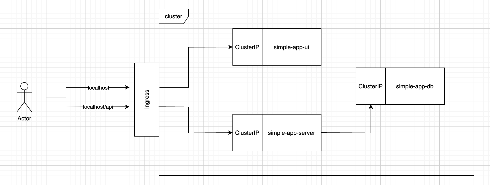
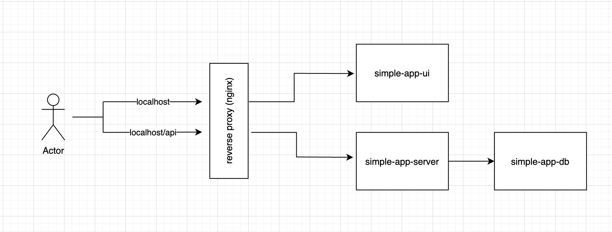

# Simple-app

Simple app created for learning purposes

## Stack

### Client

- Next.js
- React
- Typescript

### Server

- Node.js
- Express
- Typescript
- Postgres
- TypeORM

### Devops

#### Local

- Nginx (reverse proxy)
- Docker
- Docker compose

#### Production

- Docker
- Kubernetes (with hpa, ingress; local cluster -> minikube)
- Nginx

## Architecture

### Idea

Locally, we run 4 services, namely:

- client-side server (next js, to serve client-side code for development purposes)
- server-side server
- reverse proxy (to connect the two servers)
- db

On the dev environment, the front-end calls api by directly requesting server-side docker container (routing handled by nginx reverse proxy).

On prod env, we have separate pods for FE and BE (so they can be scaled separately). Request from the user first hits the ingress controller (which routes the traffic). All traffic going to `/` hits FE 8s service. The FE deployment runs nginx server which listens to the requests and returns static FE code to the user.
On the other hand requests going to `/api/*` are directed to BE service.

### Cluster diagram



### Local development diagram



## Local development

### How to run

To run the app, you need to:

1.  install client-side deps

`$ cd ./web_client && yarn`

2.  install client-side deps

`$ cd ./web_server && yarn`

3.  run the app via docker-compose

`$ docker compose -f docker-compose.dev.yaml up`

And voilà, now just head to `http://localhost` and you should see the app running

## Production

On production, we have separate prod images for Front-end app and Back-end API -> FE will be served by nginx server, the BE will serve only as an API. Whole project will be deployed by K8S, but before we run any `kubectl` commands, we need to prepare Docker images first.

### Before you start

Before you build any image, you need to start the `minikube` and then output environment variables needed to point the local Docker daemon to the minikube internal Docker registry:

1. `$ minikube start`

2. `$ eval $(minikube -p minikube docker-env)`

We need to do it as we're using `imagePullPolicy: Never`, which means we'll use local container images. So first we need to set proper env variables and the build the images to add them to minikube's image registry.

### Building the production image

#### Building Front-end prod image

To build FE production Docker image, you need to:

1. build FE Docker container

`$ docker build -t simple-app-ui -f ./web_client/Dockerfile.prod ./web_client`

#### Building Back-end prod image

To build BE production Docker image, you need to:

1. build BE image

`$ docker build -t simple-app-server -f ./web_server/Dockerfile.prod ./web_server`

### Running with Kubernetes (locally, on minikube)

Now we're able to deploy the app to K8S! We'll deploy the app to local K8S cluster and for that we'll use `minikube`. To deploy the app you need to:

0. We started minikube in previous steps, but just in case -> make sure you started the `minikube` cluster

`$ minikube start`

2. Enable the metrics server

`$ minikube addons enable metrics-server`

Make sure the metrics server is running, with:

`$ kubectl top pod`

(it should print out the metrics for pods)

```
    NOTE: If you see no output, please check "Troubleshooting" section for solution
```

4. Enable ingress

`$ minikube addons enable ingress`

now wait a sec until it loads up. You can check if it's loaded with:

`kubectl get pods -n ingress-nginx`

5. Enable ingress-dns

`$ minikube addons enable ingress-dns`

6. Create a tunnel between host and minikube (in a separate terminal window)

`$ minikube tunnel`

NOTE: once again - run that command in separate terminal window, as it needs to be running when you want to see the app in web browser. Do not kill the tunnel process until you want to close down the application.

7. Deploy the application

`$ kubectl apply -f ./deployment`

That will deploy the whole application!

Great! Now your app is deployed. To see the application in the browser, head to `localhost` in the browser

#### Dashboard

If you want to see the dashboard, run:

`$ minikube dashboard`

which will automatically open up the browser tab with dashboard!

#### Local testing the auto scaler

If you want to test wether the horizontal autoscaler works, you can run

`$ kubectl run -i --tty load-generator --rm --image=busybox --restart=Never -- /bin/sh -c "while sleep 0.01; do wget -q -O- http://simple-app-ui-service; done"`

while the app is running. After some time (usually couple of minutes) of generating the load, in minikube's dashboard you should see how K8S adjusts number of running instances, depending on load target. You can also see the current targets and number of replicas by running:

`$ kubectl get hpa`

in the terminal.

## Troubleshooting

### No output after running `$ kubectl describe hpa`

1. Run `$ kubectl describe hpa`

And check for the errors, especially `AbleToScale` and `ScalingActive` in `Conditions` section
Most probably you'll see some errors there. For more info, you can run minikube dashboard:

`$ minikube dashboard`

and check for exact error, if you see the `ErrImageNeverPull` (problems with pulling docker image from registry), move to the `ErrImageNeverPull error after running deployment with kubectl` section of Troubleshooting

### ErrImageNeverPull error after running deployment with kubectl

1. Make sure you start minikube first (`$ minikube start`) and <b>after</b> that `$ eval $(minikube -p minikube docker-env)`

2. Afterwards you need to rebuild both FE and BE images one more time, for that see the `Building Front-end prod image` section
